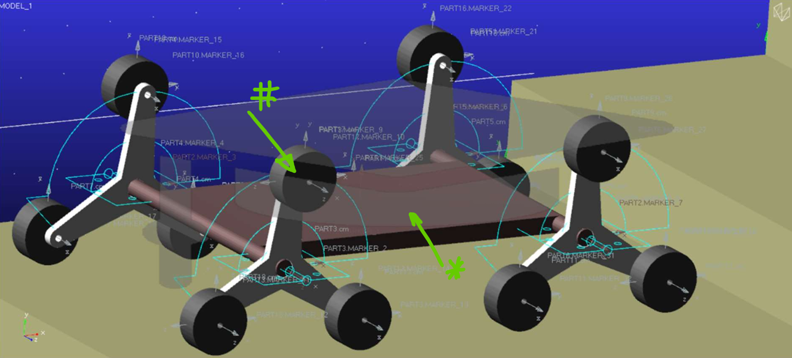

## Cel projektu

Celem było stworzenie robota, który porusza się zarówno po płaskich powierzchniach, jak i potrafi pokonać przeszkody takie jak progi i schody, poprawiając bezpieczeństwo i efektywność pracy w trudno dostępnych miejscach.

## Zakres projektu

- Dobór koncepcji konstrukcyjnej i struktury nośnej robota
- Projekt i optymalizacja geometrii w programie Adams View
- Przeprowadzenie badań symulacyjnych (trajektoria, momenty, moc)
- Dobór komponentów rzeczywistych
- Opracowanie układu sterowania i regulacji PID
- Przygotowanie schematów elektrycznych i sterujących
- Szacunkowy kosztorys budowy

## Konstrukcja

- **Mechanizm trójpalczasty** – obracające się ramiona z nieruchomymi kołami pozwalają na ruch kroczący
- **Druk 3D** – wszystkie elementy nośne wykonane z termoplastycznego tworzywa ABS
- **Całkowita masa pojazdu:** ~5 kg
- **Maksymalna wysokość pokonywanych schodów:** 175 mm
- **Czas pokonania przeszkody:** < 1 minuta

## Symulacje i analiza

Wykorzystano **MSC Adams View** do analizy:
- trajektorii środka masy i wybranych kół,
- momentów obrotowych i mocy napędów,
- wpływu geometrii na stabilność,
- sterowania z użyciem regulatora PID (prędkość i pozycja).

  

## Dobór komponentów

| Komponent | Model | Ilość | Cena | Masa (kg) |
|----------|-------|-------|------|-----------|
| Mikrokontroler | Arduino Mega 2560 | 1 | 249 zł | 0.065 |
| Napędy | Silnik 25Dx56L 12V, 33 rpm, 2.25 Nm | 4 | 142 zł/szt | 0.094 |
| Koła | 65×26 mm | 12 | 4.40 zł/szt | 0.031 |
| Zasilanie | Akumulator żelowy 12V 12Ah | 1 | 37.90 zł | 0.5 |
| Czujniki | URM37, Tilt Sensor, BME680 | 3 | ~205 zł | ~0.05 |
| Sterowniki | L298N (dwukanałowy) | 2 | 17.70 zł | 0.025 |
| Struktura | Druk 3D ABS | - | 99.99 zł/rolka | 1.774 |

**Łączny koszt:** 1355,58 zł  
**Całkowita masa robota:** 5,06 kg

## Układ sterowania

- **Jednostka centralna:** Arduino Mega
- **Sterowanie napędami:** Moduły L298N
- **Czujniki:**
  - **URM37** – czujnik odległości (ultradźwiękowy)
  - **Tilt Sensor** – wykrywanie przechyłu
  - **BME680** – sensory środowiskowe (jakość powietrza, temperatura, wilgotność)

  

Zastosowano układ regulacji PID dla zapewnienia stabilnego poruszania się po schodach bez utraty trajektorii.

## Wizualizacje i symulacje

  

## Podsumowanie

Projekt wykazał możliwość stworzenia efektywnego, lekkiego i stosunkowo taniego robota inspekcyjnego, zdolnego do pokonywania progów i schodów. Przeprowadzone symulacje potwierdziły poprawność koncepcji oraz zaproponowane rozwiązania techniczne i materiałowe.
